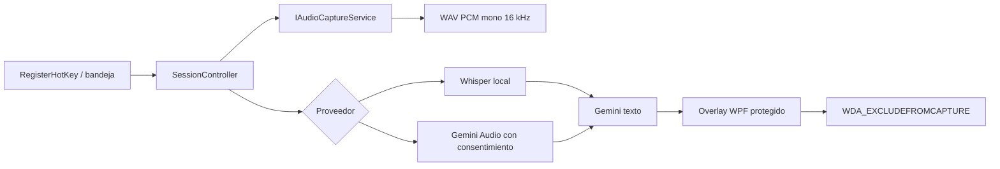

# Arquitectura Windows

## Principio de aislamiento

Todo el código Windows vive bajo `Windows/`. Los archivos `Package.swift`, `Sources/MirrorPowerAI`, `Resources/Info.plist` y `build.sh` pertenecen a la implementación macOS y no son dependencias del build Windows.

## Capas

- `MirrorPowerAI.Core`: contratos, configuración, máquina de estados, coordinación, clientes Gemini y gestión segura del modelo.
- `MirrorPowerAI.Windows`: WPF, bandeja, hotkey, WASAPI, DPAPI, Whisper y adaptadores Win32.
- `MirrorPowerAI.Core.Tests`: pruebas deterministas independientes de WPF.
- `MirrorPowerAI.Windows.Tests`: conversión de audio y wrappers Windows simulables.

## Máquina de estados

`Idle -> Capturing -> Transcribing -> RequestingAnswer -> ShowingResult -> Idle`

Cualquier fallo esperado pasa por `Error` y vuelve a un estado recuperable. `SessionController` es el único propietario de las transiciones y de la cancelación. Una segunda activación durante captura detiene; durante fases posteriores solicita cancelación, sin iniciar una sesión concurrente.

## Equivalencias de plataforma

| macOS | Windows |
|---|---|
| Core Audio Process Taps | WASAPI loopback / NAudio |
| Apple Speech | Whisper.net local o Gemini Audio explícito |
| Carbon hotkey | `RegisterHotKey` con `MOD_NOREPEAT` |
| Keychain | DPAPI `CurrentUser` |
| AppKit/SwiftUI panel | WPF opaco y DPI-aware |
| `sharingType = .none` | `WDA_EXCLUDEFROMCAPTURE` verificado |
| URLSession Gemini | `HttpClient` tipado |

## Fallo seguro del overlay

El overlay usa una ventana superior opaca (`AllowsTransparency=false`). Sólo muestra pregunta o respuesta si `SetWindowDisplayAffinity` y `GetWindowDisplayAffinity` confirman `WDA_EXCLUDEFROMCAPTURE`. Si no puede confirmarse, la información sensible no se renderiza y la bandeja ofrece reintentar o cerrar.

## Datos persistentes

- `%LOCALAPPDATA%\MirrorPowerAI\settings.json`: opciones no sensibles; excluye API key y contexto.
- `%LOCALAPPDATA%\MirrorPowerAI\secrets\gemini-api-key.bin`: API key cifrada para el usuario actual.
- `%LOCALAPPDATA%\MirrorPowerAI\secrets\project-context.bin`: contexto cifrado para el usuario actual.
- `%LOCALAPPDATA%\MirrorPowerAI\models\ggml-base.bin`: modelo verificado.

No se persisten audio, transcripciones, respuestas ni contexto en logs.
