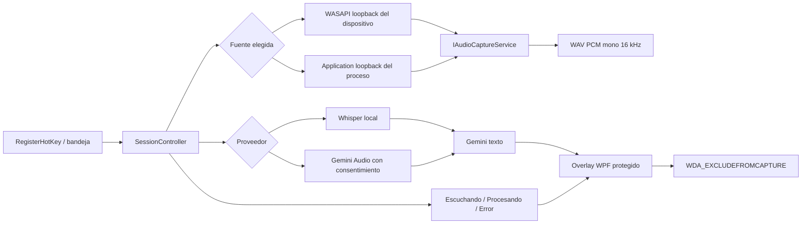

# Arquitectura Windows

## Principio de aislamiento

Todo el código Windows vive bajo `Windows/`. Los archivos `Package.swift`, `Sources/MirrorPowerAI`, `Resources/Info.plist` y `build.sh` pertenecen a la implementación macOS y no son dependencias del build Windows.

## Capas

- `MirrorPowerAI.Core`: contratos, configuración, máquina de estados, coordinación, clientes Gemini y gestión segura del modelo.
- `MirrorPowerAI.Windows`: WPF, bandeja, hotkey, WASAPI, DPAPI, Whisper y adaptadores Win32.
- `MirrorPowerAI.Core.Tests`: pruebas deterministas independientes de WPF.
- `MirrorPowerAI.Windows.Tests`: conversión de audio y wrappers Windows simulables.

La bandeja usa un icono propio generado como ICO multirresolución (16–256 px) y conserva un icono del sistema como fallback si GDI+ no puede crearlo. Esto evita depender de un binario opaco y permite que Windows seleccione una representación nítida para cada escala de pantalla.

## Máquina de estados

`Idle -> Capturing -> Transcribing -> RequestingAnswer -> ShowingResult -> Idle`

Cualquier fallo esperado pasa por `Error` y vuelve a un estado recuperable. `SessionController` es el único propietario de las transiciones y de la cancelación. Una segunda activación durante captura detiene; durante fases posteriores solicita cancelación, sin iniciar una sesión concurrente.

El contrato `MirrorPowerAI.Core.Audio.AudioCaptureException` conserva categorías seguras desde WASAPI hasta `SessionController`. La capa WPF localiza cada categoría sin reutilizar mensajes nativos: fuente ausente, desconexión/cierre, cambio del dispositivo predeterminado, límite de memoria o fallo del backend. Los identificadores y excepciones internas nunca se copian al panel.

## Equivalencias de plataforma

| macOS | Windows |
|---|---|
| Core Audio Process Taps | WASAPI device loopback o process-tree application loopback / NAudio |
| Apple Speech | Whisper.net local o Gemini Audio explícito |
| Carbon hotkey | `RegisterHotKey` con `MOD_NOREPEAT` |
| Keychain | DPAPI `CurrentUser` |
| AppKit/SwiftUI panel | WPF opaco y DPI-aware |
| `sharingType = .none` | `WDA_EXCLUDEFROMCAPTURE` verificado |
| URLSession Gemini | `HttpClient` tipado |

## Fallo seguro del overlay

El overlay usa una ventana superior opaca (`AllowsTransparency=false`). Sólo muestra estado, pregunta o respuesta si `SetWindowDisplayAffinity` y `GetWindowDisplayAffinity` confirman `WDA_EXCLUDEFROMCAPTURE`. Durante captura y procesamiento usa un modo compacto, no activable y con región viva UI Automation, equivalente al panel de estado macOS sin robar el foco de la reunión. Si no puede confirmarse la protección, no se renderiza el panel y la bandeja conserva feedback genérico.

## Datos persistentes

- `%LOCALAPPDATA%\MirrorPowerAI\settings.json`: opciones no sensibles; excluye API key y contexto.
- `%LOCALAPPDATA%\MirrorPowerAI\secrets\gemini-api-key.bin`: API key cifrada para el usuario actual.
- `%LOCALAPPDATA%\MirrorPowerAI\secrets\project-context.bin`: contexto cifrado para el usuario actual.
- `%LOCALAPPDATA%\MirrorPowerAI\models\ggml-base.bin`: modelo verificado.

No se persisten audio, transcripciones, respuestas ni contexto en logs.

La fuente de audio se compone al comenzar cada sesión. El modo global resuelve el dispositivo de salida elegido y el modo por aplicación resuelve el PID guardado o una nueva instancia con el mismo nombre de ejecutable. Si esa aplicación no está disponible, se informa del error y no se amplía silenciosamente la captura al sistema completo. `ActivateAudioInterfaceAsync` recibe `AUDIOCLIENT_ACTIVATION_PARAMS` con `PROCESS_LOOPBACK_MODE_INCLUDE_TARGET_PROCESS_TREE`; este modo no está ligado a un dispositivo físico.

Durante la captura, el adaptador inspecciona cada buffer únicamente hasta detectar por primera vez una señal que supere el umbral RMS de silencio usado por la normalización final. Expone al shell sólo ese booleano enclavado, nunca las muestras, el nivel ni metadatos del dispositivo. Así el overlay protegido puede diferenciar una sesión WASAPI abierta pero silenciosa de una fuente que realmente está entregando audio, sin añadir persistencia o telemetría.

Referencias de plataforma: [ejemplo oficial Application Loopback](https://github.com/microsoft/Windows-classic-samples/tree/main/Samples/ApplicationLoopback), [documentación de `PROCESS_LOOPBACK_MODE`](https://learn.microsoft.com/en-us/windows/win32/api/audioclientactivationparams/ne-audioclientactivationparams-process_loopback_mode) y [limitación observada con Teams de escritorio en el ejemplo de Microsoft](https://github.com/microsoft/Windows-classic-samples/issues/414).
